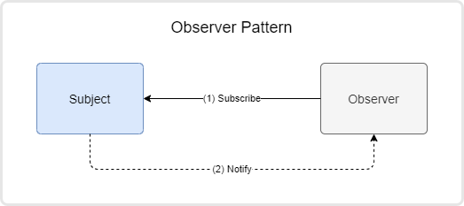
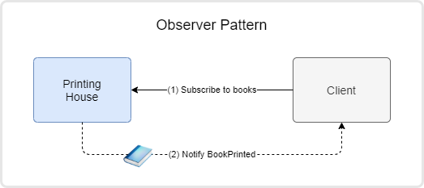

# Observer Pattern

## Definition

"The observer pattern is a software design pattern in which an object, named the subject, maintains a list of its dependents, called observers, and notifies them automatically of any state changes, usually by calling one of their methods." (Wikipedia - https://en.wikipedia.org/wiki/Observer_pattern)

## Example Overview

In our example, let's consider a Printing House that prints books, and its clients that can subscribe in advance and have each book delivered as soon as they are printed.

The implementation contains 6 projects, numbered from 1 to 6,  that describe the steps in implementing the Observer Pattern in C#.

It starts from a basic implementation (01_Basic) that can be reproduced almost identically in any other OOP language and then, through a series of steps, will adapt that implementation to make use of the C# specific features, including the `event` keyword and the out-of-the-box delegates provided by the framework.

**Note**: Notice that, after the first implementation (from step 01), while going through each of the subsequent steps, the behavior will remain the same. It will not be changed.

## How to use

The example can be used in two ways:

- **Solo mode** - Just read, one by one, the existing projects.
- **Interactive mode** - If two persons are available, they can assume the roles of a tutor and a student and implement the projects from 01 to 06 by taking turns in writing the implementation, very similar with the activity of two people doing TDD.
  - The tutor will drive the implementation by writing the main function that creates the needed instances and calls needed methods.
  - The student will implement those classes and methods.

## Steps

### Step 1 - Implement basic Observer Pattern

tutor:

- Create `Main()` method.
- Create `PrintingHouse` - no implementation.
- Create and implement `Client`.
- Create the `IBookPrintedSubscriber` interface.

student:

- Implement the `PrintingHouse` class:  `ctor`, `PrintRandomBook()`,  `Subscribe()`
- Extract the `Notify()` method.

tutor:

- Create the `Client.UnsubscribeFromBooks()`

student:

- Create the ``PrintingHouse.Unsubscribe()` method.

### Step 2 - Extract `BookPrintedEvent` class

tutor: 

- Create and implement the method: `PrintingHouse.PrintNewspaper()`.
- Request the `Client` to subscribe to a nonexistent (yet) event for the newspapers.
  - This will add another set of `Subscribe()`,  `Unsubscribe()`, and `Notify()` methods and a private list of subscribers in the `PrintingHouse` class, making the class harder to read. A refactoring is in order.

- Refactoring: Extract `Subscribe()`,  `Unsubscribe()`, and `Notify()` methods and the private list of subscribers in separate class: `BookPrintedEvent`.
- Update client to subscribe to the nonexistent (yet) `NewspaperPrinted` event.

student:

- Create another `NewspaperPrintedEvent` class and `INewspaperPrintedSubscriber` interface and use them in `PrintingHouse` and in the `Client`.

### Step 3 - Make the generic class `EventHandler`

student:

- Transform the `BookPrintedEvent` class into a generic one called: `EventBase` and create the interface `ISubscriber<TData>`.
- Use the new class and interface instead of the old ones in `PrintingHouse`.
  - Fix the `Client` implementation.

### Step 4 - Replace the `ISubscriber<TData>` interface with a delegate

tutor:

- Replace the `ISubscriber<TData>` interface with a delegate: `EventHandlerDelegate<in TData>()`.
  - Fix the `Client` implementation.

### Step 5 - Replace the implementation using C# events (non-standard)

tutor:

- In `PrintingHouse`, replace the `EventBase` class usage with the `event` keyword and the `EventHandlerDelegate` .
  - Fix the `Client` implementation.

### Step 6 - Use the C# standard event pattern

tutor:

- Add the `sender` parameter to `EventHandlerDelegate`.
- Create the `BookPrintedEventArgs` and the `NewspaperPrintedEventArgs`.
- Replace the `EventHandlerDelegate` with the `EventHandler<T>` delegate from C#.
  - Fix the `Client` implementation.
- Extract the event invocation into separate protected virtual `On` methods.